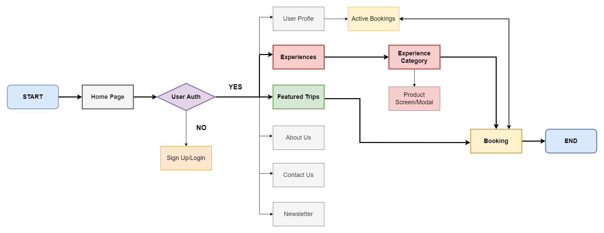

<!--
*** I'm using markdown "reference style" links for readability.
*** Reference links are enclosed in brackets [ ] instead of parentheses ( ).
*** See the bottom of this document for the declaration of the reference variables.
*** for contributors-url, forks-url, etc. This is an optional, concise syntax you may use.
*** https://www.markdownguide.org/basic-syntax/#reference-style-links
-->

<!-- PROJECT LOGO/TITLE -->

    
       
        <h1>SEAGoWhere</h1>
        <h3>Set Away With Us!</h3>

<!-- TITLE CONTENTS -->

    <h3>Final Capstone Project for Generation FSD-04</h3>
        <a href="https://liyanaaj.netlify.app/"><strong>Live Website</strong></a> <!-- CURRENT WEBSITE PLACEHOLDER IS LIYANA'S PORTFOLIO-->
           
           
              <a href="https://github.com/Rushifx/SEAgowhere">Frontend Repo</a>
              ·
              <a href="https://github.com/Liyyy9/SEAGoWhere-BackEnd">Backend Repo</a>
              ·
              <a href="https://liyanaaj.netlify.app/">Presentation Slides/Documents</a> <!-- CURRENT WEBSITE PLACEHOLDER IS LIYANA'S PORTFOLIO-->

 

<!-- TABLE OF CONTENTS -->

  
Table of Contents

  <ol>
    <li>
      <a href="#about-the-project">About The Project</a>
    </li>
    <li>
      <a href="#project-requirements">Project Requirements</a>
      <ul>
        <li><a href="#problem-statement">Problem Statement</a></li>
        <li><a href="#proposed-web-application-product">Proposed Web Application Product</a></li>
        <li><a href="#key-application-requirements">Key Application Requirements</a></li>
        <li><a href="#key-features">Key Features</a></li>
      </ul>
    </li>
    <li>
      <a href="#web-application">Web Application</a>
      <ul>
        <li><a href="#tech-stack">Tech Stack</a></li>
        <li><a href="#site-map">Site Map</a></li>
        <li><a href="#user-flow">User Flow</a></li>
        <li><a href="#entity-diagram">Entity Relationship Diagram</a></li>
      </ul>
    </li>
      <li><a href="#knowledge-and-skills-application">Knowledge and Skills Application</a></li>
      <ul>
        <li><a href="#behavioural-skills-and-mindsets-applied">Behavioural Skills and Mindsets Applied</a></li>
        <li><a href="#skill-1">Skill 1</a></li>
        <li><a href="#skill-2">Skill 2</a></li>
        <li><a href="#skill-3">Skill 3</a></li>
        <li><a href="#skill-4">Skill 4</a></li>
      </ul>
      <li><a href="#project-management">Project Management</a></li>
      <ul>   
        <li><a href="#project-timeline">Project Timeline</a></li>
        <li><a href="#future-roadmap">Future Roadmap</a></li>
        <li><a href="#team-composition">Team Composition</a></li>
      </ul>
      <li><a href="#key-lessons-learnt">Key Lessons Learnt</a></li>
      <li><a href="#contact">Contact</a></li>
  </ol>

<!-- ABOUT THE PROJECT -->

## About The Project

"Lorem ipsum dolor sit amet, consectetur adipiscing elit, sed do eiusmod tempor incididunt ut labore et dolore magna aliqua. Ut enim ad minim veniam, quis nostrud exercitation ullamco laboris nisi ut aliquip ex ea commodo consequat. Duis aute irure dolor in reprehenderit in voluptate velit esse cillum dolore eu fugiat nulla pariatur. Excepteur sint occaecat cupidatat non proident, sunt in culpa qui officia deserunt mollit anim id est laborum."

---

<!-- PROJECT REQUIREMENTS -->

## Project Requirements

### Problem Statement
A large segment of travel package and booking websites as web applications can swing between being too utilitarian or having too many details, leading to a diminished User Experience as well as information overload. International travel websites, being globally focused, can also lack a level of curation.

### Proposed Web Application Product
Lorem ipsum dolor sit amet, consectetur adipiscing elit, sed do eiusmod tempor incididunt ut labore et dolore magna aliqua.

### Key Application Requirements
Lorem ipsum dolor sit amet, consectetur adipiscing elit, sed do eiusmod tempor incididunt ut labore et dolore magna aliqua.

### Key Features
Lorem ipsum dolor sit amet, consectetur adipiscing elit, sed do eiusmod tempor incididunt ut labore et dolore magna aliqua.

---

<!-- WEB APPLICATION -->

## Web Application 

### Tech Stack 
Some air-time is warranted to talk about skills and the applications that each of you had trained and prepared for and later, demonstrated through each assessment and culminating into a capstone. 

Lorem ipsum dolor sit amet, consectetur adipiscing elit, sed do eiusmod tempor incididunt ut labore et dolore magna aliqua.

Standard Frontend Web Stack with use of Bootstrap CSS Framework for responsive design components

Backend Spring Java Persistence API (Spring JPA) as persistence layer with Springboot
MySQL for RDBMS
Java OOP langauge
Spring JPA for Persistence Layer
Spring Framework

Tools
VSS and IntelliJ IDE environment
Git and Github for Version Control 
Mockito and JUnit5 Framework for testing 
Postman API testing tool 

| Frontend          | Backend             | Tools               |
| :---------------- | :------------------ | :-------------      |
| HTML5             | MySQL               | Visual Studio Code  |
| CSS3              | Java                | IntelliJ IDEA       |
| JavaScript(JS)8   | Spring Data JPA     | Github              |
| Bootstrap V5.3.3  | Spring Framework    | Mockito             |
|                   |                     | JUnit 5             |
|                   |                     | Postman             |

### Site Map

Lorem ipsum dolor sit amet, consectetur adipiscing elit, sed do eiusmod tempor incididunt ut labore et dolore magna aliqua.

 

### User Flow
A key focus of this web application was the user flow and intuitive experience of a visitor visting, signing up and booking a package, whilst ensuring credential and payment security throughout. 

 

This is acheived primarily through the use of the following Java dependency injections within Spring JPA:
- User authentication via JWT (JSON Web Token)
- Form validation and constraints (Spring Framework Web Security/Jakarta Bean validation)

Briefly state key dependencies used in Backend

### Entity Relationship Diagram
Lorem ipsum dolor sit amet, consectetur adipiscing elit, sed do eiusmod tempor incididunt ut labore et dolore magna aliqua.

 

---

<!-- BSM AND KNOWLEDGE APPLICATION -->

## Knowledge and Skills Application

### Behavioural Skills and Mindsets Applied
Lorem ipsum dolor sit amet, consectetur adipiscing elit, sed do eiusmod tempor incididunt ut labore et dolore magna aliqua.

### Skill 1
Lorem ipsum dolor sit amet, consectetur adipiscing elit, sed do eiusmod tempor incididunt ut labore et dolore magna aliqua.

### Skill 2
Lorem ipsum dolor sit amet, consectetur adipiscing elit, sed do eiusmod tempor incididunt ut labore et dolore magna aliqua.

### Skill 3
Lorem ipsum dolor sit amet, consectetur adipiscing elit, sed do eiusmod tempor incididunt ut labore et dolore magna aliqua.

### Skill 4
Lorem ipsum dolor sit amet, consectetur adipiscing elit, sed do eiusmod tempor incididunt ut labore et dolore magna aliqua.

---

<!-- PROJECT MANAGEMENT -->

## Project Management

### Project Timeline
Lorem ipsum dolor sit amet, consectetur adipiscing elit, sed do eiusmod tempor incididunt ut labore et dolore magna aliqua.

### Future Roadmap
Lorem ipsum dolor sit amet, consectetur adipiscing elit, sed do eiusmod tempor incididunt ut labore et dolore magna aliqua.

### Team Composition
Lorem ipsum dolor sit amet, consectetur adipiscing elit, sed do eiusmod tempor incididunt ut labore et dolore magna aliqua.

---

<!-- SALIENT POINTS -->

## Key Lessons Learnt

## Contact

