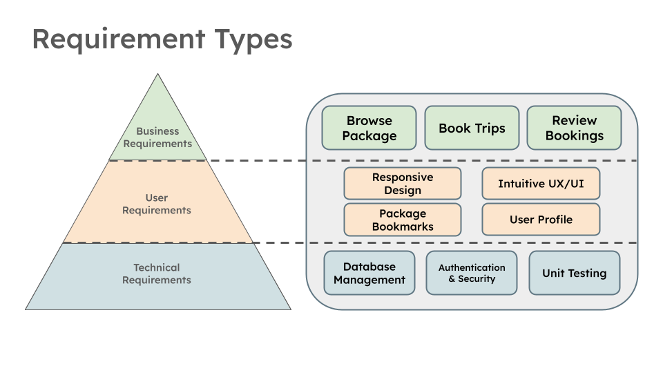
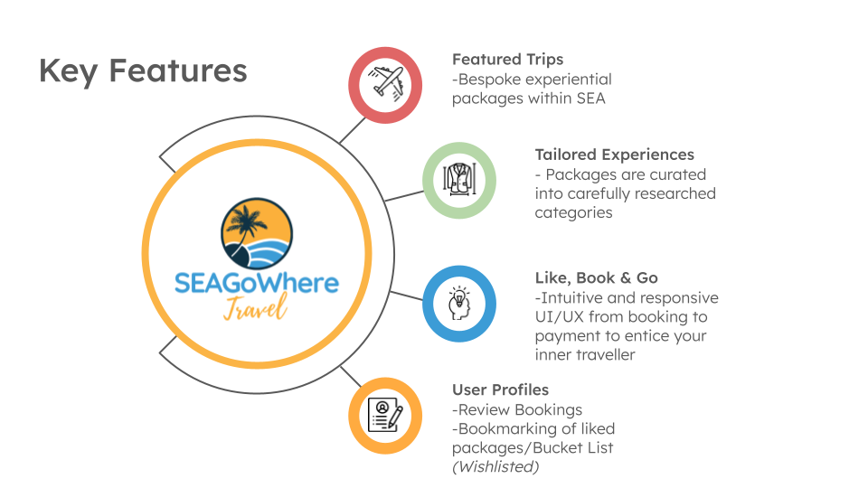

<!--
*** I'm using markdown "reference style" links for readability.
*** Reference links are enclosed in brackets [ ] instead of parentheses ( ).
*** See the bottom of this document for the declaration of the reference variables.
*** for contributors-url, forks-url, etc. This is an optional, concise syntax you may use.
*** https://www.markdownguide.org/basic-syntax/#reference-style-links
-->

<!-- PROJECT LOGO/TITLE -->

        
        <h2>SEAGoWhere    Set Away With Us!</h2>

<!-- TITLE CONTENTS -->

    <h3>Final Capstone Project for Generation FSD-04</h3>
        <a href="https://liyanaaj.netlify.app/"><strong>Live Website</strong></a> <!-- CURRENT WEBSITE PLACEHOLDER IS LIYANA'S PORTFOLIO-->
           
           
              <a href="https://github.com/Rushifx/SEAgowhere">Frontend Repo</a>
              ·
              <a href="https://github.com/Liyyy9/SEAGoWhere-BackEnd">Backend Repo</a>
              ·
              <a href="https://liyanaaj.netlify.app/">Presentation Slides/Documents</a> <!-- CURRENT WEBSITE PLACEHOLDER IS LIYANA'S PORTFOLIO-->

 

<!-- TABLE OF CONTENTS -->

  
Table of Contents

  <ol>
    <li>
      <a href="#about-the-project">About The Project</a>
    </li>
    <li>
      <a href="#project-requirements">Project Requirements</a>
      <ul>
        <li><a href="#problem-statement">Problem Statement</a></li>
        <li><a href="#proposed-web-application-product">Proposed Web Application Product</a></li>
        <li><a href="#key-application-requirements">Key Application Requirements</a></li>
        <li><a href="#key-features">Key Features</a></li>
      </ul>
    </li>
    <li>
      <a href="#web-application">Web Application</a>
      <ul>
        <li><a href="#tech-stack">Tech Stack</a></li>
        <li><a href="#site-map">Site Map</a></li>
        <li><a href="#user-flow">User Flow</a></li>
        <li><a href="#entity-diagram">Entity Relationship Diagram</a></li>
      </ul>
    </li>
      <li><a href="#knowledge-and-skills-application">Knowledge and Skills Application</a></li>
      <ul>
        <li><a href="#behavioural-skills-and-mindsets-applied">Behavioural Skills and Mindsets Applied</a></li>
        <li><a href="#skill-1">Skill 1</a></li>
        <li><a href="#skill-2">Skill 2</a></li>
        <li><a href="#skill-3">Skill 3</a></li>
        <li><a href="#skill-4">Skill 4</a></li>
      </ul>
      <li><a href="#project-management">Project Management</a></li>
      <ul>   
        <li><a href="#project-timeline">Project Timeline</a></li>
        <li><a href="#future-roadmap">Future Roadmap</a></li>
        <li><a href="#team-composition">Team Composition</a></li>
      </ul>
      <li><a href="#key-lessons-learnt">Key Lessons Learnt</a></li>
      <li><a href="#contact">Contact</a></li>
  </ol>

<!-- ABOUT THE PROJECT -->

## About The Project

"Lorem ipsum dolor sit amet, consectetur adipiscing elit, sed do eiusmod tempor incididunt ut labore et dolore magna aliqua. Ut enim ad minim veniam, quis nostrud exercitation ullamco laboris nisi ut aliquip ex ea commodo consequat. Duis aute irure dolor in reprehenderit in voluptate velit esse cillum dolore eu fugiat nulla pariatur. Excepteur sint occaecat cupidatat non proident, sunt in culpa qui officia deserunt mollit anim id est laborum."

---

<!-- PROJECT REQUIREMENTS -->

## Project Requirements

### Problem Statement
A large segment of travel package and booking websites as web applications can swing between being too utilitarian or having too many details, leading to a diminished User Experience as well as information overload. International travel websites, being globally focused, can also lack a level of curation.

- Image 1, Caption
- Image 2, Caption
- Image 3, Caption

### Proposed Web Application Product
Lorem ipsum dolor sit amet, consectetur adipiscing elit, sed do eiusmod tempor incididunt ut labore et dolore magna aliqua.

### Key Application Requirements

To achieve a Minimum Viable Product (MVP) for the proposed web application, the following key requirements were derived from a requirement analysis, illustrated below through an iterative process, as well as the MoSCoW prioritization. 
 
The aim was to engineer based off both the cirriculum learnt, as well as in alignment of the overall vision of the application a set of key required features in the domain of:

- Business Requirements - The Application has to have travel package, booking and payment feunctionality 
- User Requirements - The UX/UI as well as the client-side frontend needs to be intuitive and responsive to a user to book and poay for a package
- Technical Requirements - The server-side backend architecture, which includes aspects such as the database, backend application and APIs endpoints necessary for user login, authentication and package booking

 

 

### Key Features
The key application and experience features of the SEAGoWhere web application includes: 

- <h4> Featured Trips</h4> - Bespoke travel experiences within SEA
- <h4> Tailored Experiences</h4> Compared to other travel web applications, SEAGoWhere's packages are carefully curated into selected category buckets, which also from part of the overall user experience
- <h4> Like It? Just Book and Go</h4> - The technology stack used, coupled with frontend design allows from a seamless, simple experience with key details to help travellers make a decision
- <h4> User Profiles</h4> - Portal that acts as a user's unique travel passport. Book a trip? It's in there! Unsure if it's the trip? Bookmark it in your Bucket List for future reference*</h4>

*Wishlist Feature

 

 
---

<!-- WEB APPLICATION -->

## Web Application 

### Tech Stack 
The stack of technologies chosen for this application comes from two key criteria:
- Fufillment of our stated key requirements (particularly in User and Technical requirements)
- DIrect application of technical skills and technologies learnt from Generation cirriculum 

| Frontend          | Backend             | Tools               |App Deployment      |
| :---------------- | :------------------ | :-------------      |:-------------      |
| HTML5             | MySQL (Workbench)   | Visual Studio Code  |Netlify             |
| CSS3              | Java                | IntelliJ IDEA       |                    |
| JavaScript(JS)8   | Spring Data JPA     | Github              |                    |
| Bootstrap V5.3.3  | Spring Framework    | Mockito             |                    |
|                   |                     | JUnit 5             |                    |
|                   |                     | Postman             |                    |

 
 

Our Frontend stack consists of the 3 core programming languages, with the decision to incorporate the [Bootstrap](https://getbootstrap.com/) V5.3.3 Framework and library owing to its responsive design components and ease of insertion and use within HTML/CSS code syntax.

For our Backend stack, the decision to use ***[MySQL](https://www.mysql.com/) Relational Database Management System (RDBMS)*** and ***[Spring](https://spring.io/) Application Framework***, inclusive of ***[SpringBoot](https://spring.io/projects/spring-boot)*** and ***[Spring](https://spring.io/projects/spring-data-jpa) Data JPA (Java Persistence API)*** within a Java language environment primarily stems from Spring's versitality and ease of deployability, particularly in the area of autoconfigured **dependency injections**. This includes the ***[Spring](https://spring.io/projects/spring-security) Security*** dependency, which accords highly customizable authentication and access control frameworks, critical to our application requirements as a travel booking website. 

The suite of tools that support this tech stack include Visual Studio Code and IntelliJ IDEA Integrated Development Environment (IDE) for its versatility as well as Git Terminal Command Line Utility (CLI) features, with ***[GitHub](http://github.com/)*** serving as the repository platform for code sharing, deployment and version control. This is rounded off by a suite of validation and unit testing frameworks, including ***[Mockito](https://site.mockito.org/)***, ***[JUnit5](https://junit.org/junit5/)*** and ***[Postman](https://www.postman.com/)*** API platform.

 

### Site Map

SEAGoWhere's Site Map diagramming can be defined as a typical product booking application, with heavy emphasis on the product experience and payment (Experiences, Featured Trips, Booking), which is illustrated in the User Flow. This structure also allows for future expansion into either further subcategories or features. 

 

 

### User Flow

A key focus of this web application was the user flow and intuitive experience of a visitor visting, signing up and booking a package, whilst ensuring credential and payment security throughout. 

 

This is acheived primarily through the use of the following Java dependency injections within Spring JPA:
- User authentication via JWT (JSON Web Token)
- Form validation and constraints (Spring Framework Web Security/Jakarta Bean validation)

Other supporting dependencies, tools and libraries include: 
- Jackson Annotation (JSON Manipulation)
- Maven (Dependency Management)
- Lombok (Java Library)

### Entity Relationship Diagram

(To confirm ERD Saturday Morning for lock-in)

Lorem ipsum dolor sit amet, consectetur adipiscing elit, sed do eiusmod tempor incididunt ut labore et dolore magna aliqua.

 

---

<!-- BSM AND KNOWLEDGE APPLICATION -->

## Knowledge and Skills Application

### Behavioural Skills and Mindsets Applied

Intersect with the Martin's feedback on feature/tech learning apppication 
Lorem ipsum dolor sit amet, consectetur adipiscing elit, sed do eiusmod tempor incididunt ut labore et dolore magna aliqua.

### Skill 1
**USER LOGIN AND AUTHENTICATION**
Lorem ipsum dolor sit amet, consectetur adipiscing elit, sed do eiusmod tempor incididunt ut labore et dolore magna aliqua.

### Skill 2
**UX UI for TRAVEL PACKAGE**
Lorem ipsum dolor sit amet, consectetur adipiscing elit, sed do eiusmod tempor incididunt ut labore et dolore magna aliqua.

### Skill 3
**BACKEND FOR BOOKING AND PAYMENT**
Lorem ipsum dolor sit amet, consectetur adipiscing elit, sed do eiusmod tempor incididunt ut labore et dolore magna aliqua.

### Skill 4
**USER PROFILE AND API***
Lorem ipsum dolor sit amet, consectetur adipiscing elit, sed do eiusmod tempor incididunt ut labore et dolore magna aliqua.

---

<!-- PROJECT MANAGEMENT -->

## Project Management

### Project Timeline

(Finalise Saturday Monring upon schedule completion - anticipated no more new tasks after implementation of **Unit Testing**)

12 Weeks , typical 40 hours load

-Usage of Agile Principles and Scrum Framework
-Microsoft Project Planner (Buckets and Ticketing)
-Sprints Planning 
-Workload Planning and Task Switching/Pivoting
-MoSCow Prioritzation in latter part of project

### Future Roadmap

Wishlisted (MoSCow) features due to requirement prioritization due to project timeline

To be implemented future product roadmap, learning of technologies to enhance current web application 
Hypothetical schedule if additional 12-14 weeks time extension

| Wishlisted            | Details             | Technologies        |Hypothetical Timeframe  |
| :----------------     | :------------------ | :-------------      |:-------------          |
| Bucket List           | MySQL (Workbench)   | Visual Studio Code  |Netlify                 |
| Thematic Categories   | Java                | IntelliJ IDEA       |                        |
| Search Function       | Spring Data JPA     | Github              |                        |
| Payment Gateway       | Spring Framework    | Mockito             |                        |
| Subscription Features |                     |                     | JUnit 5                |                 

### Team Composition
Lorem ipsum dolor sit amet, consectetur adipiscing elit, sed do eiusmod tempor incididunt ut labore et dolore magna aliqua.

---

<!-- SALIENT POINTS -->

## Key Lessons Learnt

Already elaborated above, summarise to close the project off

<h3>Point 1</h3>
<h3>Point 2</h3>
<h3>Point 3</h3>

## Contact

<h3>Xun Chia</h3>

- [LinkedIn](https://www.linkedin.com/feed/)
- [Github](https://github.com/xunchiasg)
- [Portfolio](https://xunchia.com/)

<h3>Colin Toh</h3>

- [LinkedIn]()
- [Github]()
- [Portfolio]()

<h3>Liyana Afiqah</h3>

- [LinkedIn]()
- [Github]()
- [Portfolio]()

<h3>Charlie Tan</h3>

- [LinkedIn]()
- [Github]()
- [Portfolio]()
