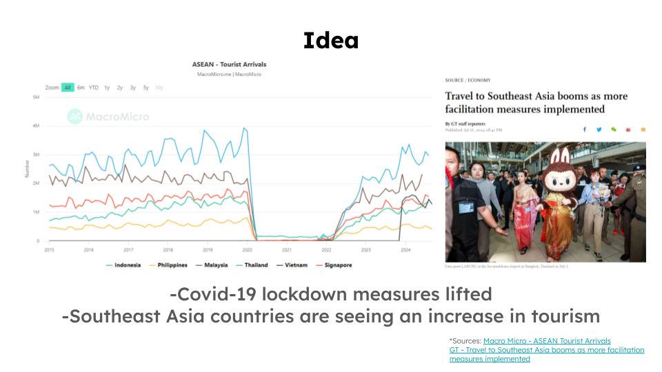

<!--
*** I'm using markdown "reference style" links for readability.
*** Reference links are enclosed in brackets [ ] instead of parentheses ( ).
*** See the bottom of this document for the declaration of the reference variables.
*** for contributors-url, forks-url, etc. This is an optional, concise syntax you may use.
*** https://www.markdownguide.org/basic-syntax/#reference-style-links
-->

<!-- PROJECT LOGO/TITLE -->

        
        <h2>SEAGoWhere    Set Away With Us!</h2>

<!-- TITLE CONTENTS -->

    <h3>Final Capstone Project for Generation FSD-04</h3>
        <a href="https://seagowhere.netlify.app/"><strong>SEAGoWhere Website</strong></a> <!-- CURRENT WEBSITE PLACEHOLDER IS LIYANA'S PORTFOLIO-->
           
           
              <a href="https://github.com/Rushifx/SEAgowhere">Frontend Repo</a>
              ·
              <a href="https://github.com/Liyyy9/SEAGoWhere-BackEnd">Backend Repo</a>
              ·
              <a href="https://drive.google.com/drive/folders/15WKz0gDHOjkiZ1vZeMbvkwCUz0h_8htj?usp=sharing">Presentation Slides/Documents</a> 

 

<!-- TABLE OF CONTENTS -->

  
Table of Contents

  <ol>
    <li>
      <a href="#about-the-project">About The Project</a>
    </li>
    <li>
      <a href="#project-requirements">Project Requirements</a>
      <ul>
        <li><a href="#idea">Idea</a></li>
        <li><a href="#proposed-web-application-product">Proposed Web Application Product</a></li>
        <li><a href="#key-application-requirements">Key Application Requirements</a></li>
        <li><a href="#key-features">Key Features</a></li>
      </ul>
    </li>
    <li>
      <a href="#web-application">Web Application</a>
      <ul>
        <li><a href="#tech-stack">Tech Stack</a></li>
        <li><a href="#site-map">Site Map</a></li>
        <li><a href="#user-flow">User Flow</a></li>
        <li><a href="#entity-diagram">Entity Relationship Diagram</a></li>
      </ul>
    </li>
      <li><a href="#knowledge-and-skills-application">Knowledge and Skills Application</a></li>
      <ul>
        <li><a href="#behavioural-skills-and-mindsets-applied">Behavioural Skills and Mindsets Applied</a></li>
        <li><a href="#skill-1">Skill 1</a></li>
        <li><a href="#skill-2">Skill 2</a></li>
        <li><a href="#skill-3">Skill 3</a></li>
        <li><a href="#skill-4">Skill 4</a></li>
      </ul>
      <li><a href="#project-management">Project Management</a></li>
      <ul>   
        <li><a href="#project-timeline">Project Timeline</a></li>
        <li><a href="#future-roadmap">Future Roadmap</a></li>
        <li><a href="#team-composition">Team Composition</a></li>
      </ul>
      <li><a href="#key-lessons-learnt">Key Lessons Learnt</a></li>
      <li><a href="#contact">Contact</a></li>
  </ol>

<!-- ABOUT THE PROJECT -->

## About The Project

SEAGoWhere is a full-stack web application that empowers modern travelers and thrill-seekers to discover unique and exciting experiences across Southeast Asia.

Our platform simplifies the journey from inspiration to exploration, offering a visually stunning user interface and booking experience supported by robust backend systems for seamless booking and payment in a secure, user authenticated environment. 
 
<!-- PROJECT REQUIREMENTS -->

## Project Requirements

### Idea
Post-COVID has seen a resurgence in travel ("Revenge Travel") throughout the world as a response to the prolonged lockdowns during that period. This is also reflected within the South East Asian (SEA) region, where tourism levels have been edging towards pre-pandemic levels. 

As such, Team SEAGoWhere sees this backdrop as an opportunity to create a software web application to address this market opportunity, opting to focus on providing bespoke and curated travel experience as a unique product offering to such travelers.

 

 

### Proposed Web Application Product
The team thus proposes and developed the following full stack web application product, **SEAGoWhere**.

SEAGoWhere is a 'Bespoke Experiential Travel Package Website' where a user can, in three simple steps, both on desktop and mobile:

- Access Expertly curated packages unique to South East Asia 
- See what you like? Simply book it now!
- Your adventure begins!

[**Design**](https://docs.google.com/drawings/d/1nZnkPzIRbuK2zkWE0VKzaOYUx5HRV6sWJSLApGe5t9Q/edit?usp=sharing)

 

 

### Key Application Requirements

To achieve a Minimum Viable Product (MVP) for the proposed web application, the following key requirements were derived from a requirement analysis, illustrated below through an iterative process, as well as the use of the MoSCoW prioritization method (Must, Should and Could haves). 

This was done to engineer a set of key required features that is aligned to the overall vision of the application, as well as directly apply both technical and bahvioural skills picked up via the cirriculum. As such, the requirements defined are that of: 

- Business Requirements - The Application has to allow a user to browse for trips, book trips and review their bookings
- User Requirements - The UX/UI as well as the client-side frontend needs to be intuitive and responsive to achieve the defined business requirements
- Technical Requirements - The server-side backend architecture, which includes aspects such as the database, backend application and APIs endpoints necessary for user login, authentication and trip bookings need to support the above

 

 

### Key Features
The key features of the SEAGoWhere web application includes: 

- <h4> Tailored Trip Experiences</h4> Compared to other travel web applications, SEAGoWhere's packages are carefully curated into selected category buckets, which also form part of the overall user experience
- <h4> Like It? Just Book and Go</h4> - The technology stack used, coupled with frontend design allows from a seamless, frictionless user experience in browing and booking
- <h4> User Profile</h4> - Portal that acts as a user's unique travel passport. Book a trip? It's in there! Unsure if it's the trip? Bookmark it in your Bucket List for future reference*</h4>

*Wishlisted Feature

 

 

<!-- WEB APPLICATION -->

## Web Application 

### Tech Stack 
The stack of technologies chosen for this application comes from two main criteria:
- Fufillment of key application requirements 
- DIrect application of technical skills and technologies learnt from Generation cirriculum within the web application
 

| Frontend          | Backend             | Tools               |App Deployment      |
| :---------------- | :------------------ | :-------------      |:-------------      |
| HTML5             | MySQL (Workbench)   | Visual Studio Code  |Netlify             |
| CSS3              | Java                | IntelliJ IDEA       |                    |
| JavaScript(JS)8   | Spring Data JPA     | Github              |                    |
| Bootstrap V5.3.3  | Spring Framework    | Mockito             |                    |
|                   | Apache Maven        | JUnit 5             |                    |
|                   |                     | Postman             |                    |

 

#### Front End
Our Frontend stack consists of the 3 core programming languages, with the decision to incorporate the [Bootstrap](https://getbootstrap.com/) V5.3.3 Framework and library owing to its responsive design components and ease of use within HTML/CSS syntax.

#### Back End
For our Backend stack, the decision to use ***[MySQL](https://www.mysql.com/) Relational Database Management System (RDBMS)*** and ***[Spring](https://spring.io/) Application Framework***, inclusive of ***[SpringBoot](https://spring.io/projects/spring-boot)*** and ***[Spring](https://spring.io/projects/spring-data-jpa) Data JPA (Java Persistence API)*** within a Java language environment primarily stems from Spring's versitality and ease of deployability, particularly in the area of autoconfigured **dependency injections**. This includes the ***[Spring](https://spring.io/projects/spring-security) Security*** dependency, which accords highly customizable authentication and access control frameworks, critical to our application requirements as a travel booking website. 

#### Tools/Deployment
The suite of tools that support this tech stack include Visual Studio Code and IntelliJ IDEA Integrated Development Environment (IDE) for its versatility as well as Git Terminal Command Line Utility (CLI) features, with ***[GitHub](http://github.com/)*** serving as the repository platform for code sharing, deployment and version control. This is rounded off by a suite of validation and unit testing frameworks, including ***[Mockito](https://site.mockito.org/)***, ***[JUnit5](https://junit.org/junit5/)*** and ***[Postman](https://www.postman.com/)*** API platform.
 

### Site Map

SEAGoWhere's Site Map diagramming can be defined as a typical product booking application, with heavy emphasis on product experience and payment (Experiences, Featured Trips, Booking) illustrated in the User Flow. This also allows for future expansion into either further subcategories or features. 

 

### User Flow

A key focus of this web application was the user flow and intuitive experience of a visitor visting, signing up and booking a package, whilst ensuring credential and payment security throughout. 

 

This is acheived primarily through the use of the following Java dependency injections within Spring JPA:
- User authentication via JWT (JSON Web Token)
- Form validation and constraints (Spring Framework Web Security/Jakarta Bean validation)

Other supporting dependencies, tools and libraries include: 
- Jackson Annotation (JSON Manipulation)
- Apache Maven (Dependency Management)
- Lombok (Java Library)
 

### Entity Relationship Diagram

For our database, we have opted to use MySQL Workbench RDBMS owing to its open-source nature and utility to fitting our project requirements. 
  The database, as well as table cardinality is designed to acheive the required user flow and experience for a package booking.

 

<!-- BSM AND KNOWLEDGE APPLICATION -->

## Knowledge and Skills Application

### Behavioural Skills and Mindsets Applied

Technical and non-technical aspects of the cirriculum, including the application of Behaviours, Skills and Mindsets (BSM) is illustrated within SEAGoWhere main User Flow:

### User Signup and Authentication

 

When a user first signs up for an account on SEAGoWhere, several REST API requests are made based off the form fields (POST) and the database is updated. This process will be unique for each user ID (Email).

Authentication for subsequent logins will involve JSON Web Token (JWT) authentication (AuthO by Okta) to authorise login and updates to a user profile.

 

JSON Web Token (JWT) authentication to encode unique user information (Payload) as a Springboot dependency feature via the process of 'Salting'. The encoded token is split into three parts - the header, payload and signature.

### Booking and Payment of Package

 

When the user browses through the site, either at the 'Experiences' or 'Featured Trips' pages, several API calls (GET) are made for Springboot to load the relevant packages containing image and text assets from the database. A pagination JS script is embedded within the HTML to throttle loading at the backend. 

 

The database adminstrator will have access to manipulate the database downstream, either in terms of modifying the number and content of experience categories, or the pacakges themselves. This includes aspects such as create, update and delete.

 

Once the user opts to book a package, he will be taken to the booking page where an API call to retreive the relevant package will be shown. Upon input of passenger details (where the booking is made), the booking instance will be created (GET) and stored in the database linked to the unique user. The booking summary will also be updated to reflect the number of passengers in a single booking.

 

A successful booking with a handshake from the front and backend will result in the following screen.

 

### User Profile 

As per the database table, the user profile will contain fields tied to that particular user. This includes associated bookings, where an API call will retrieve the relevant booking to display within the page. 

 

In terms of testing the website's robustness, the use of [Postman](https://www.postman.com/) API platform was used for to make dummy API calls to SEAGoWhere. Internally, within the Java application itself, the use of Unit Testing dependencies such as Mockito and JUnit 5 is also conducted.

---

<!-- PROJECT MANAGEMENT -->

## Project Management

### Project Timeline

The SEAGoWhere web application was planned, designed and built over a period of 12 weeks from start to handoff, in line and pace with the academic cirriculum of the Generation bootcamp.

To aid in rapid development as well as direct application from course to product, agile principles and scrum framework were used to aid in workload planning and prioritization, with the use of Microsoft Planner as a scrum board to plan sprints, as illustrated in three sprint periods where multiple aspects of the application were developed in tandem towards the close of the capstone.

The use of Github platform and repository was also a key tool in managing version control in code revisions (via approved reviews and merges) throughout the software development cycle, particularly during sprints. 

 

### Future Roadmap

As part of the web application development, several application features were proposed with the intent to enhance either Business or User requirements. Some of these features were wishlisted as a result of feature prioritzation within the stipulated delivery timeframe. 

| Wishlisted            | Details                                                           | Technologies        |Hypothetical Timeframe  |
| :----------------     | :------------------                                               | :-------------      |:-------------          |
| Bucket List           | Proposed Package curation of user unique 'Bucket List' criteria   | JS, Spring Framework|Q4 2024                 |
| Thematic Categories   | Increased Categories, Tags                                        | MySQL               |Q1 2025                 |
| Search Function       | Search bar with Results                                           | JS, React           |Q1 2025                 |
| Payment Gateway       | Secure Payment Gateway portal API (Stripe)                        | Java                |Q1 2025                 |
| Subscription Features | Paid Subscription service with customised curation to user profile| JS, Spring Framework|Q2 2025                 |    

 *To be implemented future product roadmap with a hypothetical schedule if additional 12-14 weeks time extension

### Team Composition

The SEAGoWhere team composition, as well as its task distribution is listed below. While each team member has a general defined role and scope, the usage of agile principles and scrum methodology, as well as the application of BSMs such as **Proactiveness** and **Teamwork** means that each member steps up whenever needed to make the project a success. 

| Charlie - Full Stack Support    | Colin - Backend/Frameworks    | Liyana - Frontend/UI    |Xun - Project Management  |
| :----------------               | :------------------           | :-------------          |:-------------            |
| Package Data Wrangling          | Github Repo Owner             | UX/UI Owner             |Product Owner             |
| Package Booking Modal (FE)      | Spring Framework (BE)         | Frontend Design (FE)    |Package Design (FE)       |
| Presentation (Deck Support)     | User Login/JWT Authentication | Design Documentation    |Unit Testing (BE)         |
|                                 | Package Booking               | MySQL Database (BE)     |Presentation (Deck)       |
|                                 | Payment                       | Frontend Design (FE)    |Github Readme             |  

FE - Frontend  
BE - Backend

---

<!-- SALIENT POINTS -->

## Key Lessons Learnt

<h4>- Each team member, regardless of their scope and level of technical competency has a part to play within a functional team</h4>
<h4>- A problem solving and communicative team approach is critical in ensuring project outcome success</h4>
<h4>- Having SMART goals, as well as being agile and prioritising what needs to be done, even if it means disagreeing and committing is sometimes part of a software development cycle</h4>

## Contact

<h3>Xun Chia</h3>

- [LinkedIn](https://www.linkedin.com/in/xunc/)
- [Github](https://github.com/xunchiasg)
- [Portfolio](https://xunchia.com/)

<h3>Colin Toh</h3>

- [LinkedIn](www.linkedin.com/in/toh-colin)
- [Github](https://github.com/Rushifx)
- [Portfolio](https://colintohportfolio.netlify.app/)

<h3>Liyana Afiqah</h3>

- [LinkedIn](https://www.linkedin.com/in/liyanaafiqahjazmi/)
- [Github](https://github.com/Liyyy9)
- [Portfolio](https://liyanaaj.netlify.app/)

<h3>Charlie Tan</h3>

- [Github](https://github.com/Ceeyestano)

